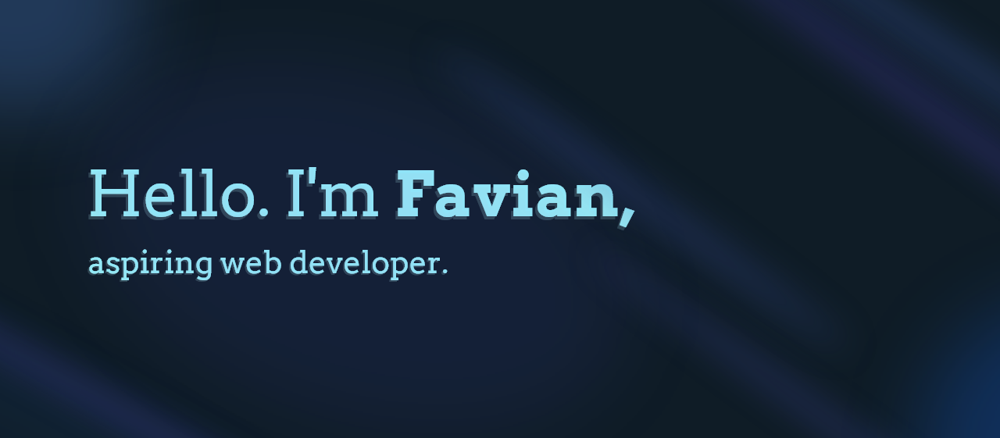

## Hi there, I'm Favian Teo.

I'm 21, and I live in Singapore! I'm not a very interesting person. But here's some stuff that I like:

**🎸 MUSIC!** 

I play the classical/acoustic guitar, and a sprinkle of piano. Music's often my go-to when the day gets long and/or boring. A few of my favourite modern musicians are Lisa Hannigan, Gregory Alan Isakov and CHVRCHES, in that order :) And I'm a huge fan of the oldies: Chopin, Lizst and Augustin Barrios; to name a few.

**⚙️ TECH!** 

When I'm not immersing myself in music, I'm adept with new technology, languages, (*~and 10 new JS frameworks~*) that spring up from time to time. Be it software or hardware, I'm always on the lookout for new breakthroughs in the ever-growing and adapting environment of technology.

**🎮 GAMING!** 

At the end of the day, I might just wind down for a few hours of gaming. Well, not as much as I did a few years ago, but I am still very critical of well-constructed and enjoyable games. One of my absolute favourites is Far Cry 5; love its open-world design!

## My developer proficiency 📖
I love to expose myself to the many quirks of different web technologies when I have time. Here's what I'm comfortable with so far:

             
- *and many more to come...*

## What I've made ✅
- [**java-android-bitjam**] (Java, Android) - A music player for Android.

- [**ts-discord-bitjam**] (TypeScript, Discord) - A music bot for Discord.

- [**react-redux-findmyfood**] (React.ts, Redux Toolkit) - A restaurant lookup and review website.

- [**djs-message-commands**] (TypeScript, Discord) - An npm package to facilitate creating and handling message commands in Discord.

- [**flutter-recipedia**] (Flutter) - A Flutter application for creating, and sharing recipes with the people you follow.

- [**flow**] (Laravel, React) - A workflow management tool on the web. 

+more projects that can't fit this list!

## What I'm working on 🛠️
- [**discord-hyperion**] (TypeScript, Discord) - A Discord bot framework in TypeScript that aims to provide good DX and to be as robust as possible. 

[**java-android-bitjam**]: https://github.com/Shockch4rge/java-android-BitJam
[**ts-discord-bitjam**]: https://github.com/Shockch4rge/ts-discord-bitjam
[**ts-discord-bittrivia**]: https://github.com/Shockch4rge/ts-discord-bittrivia
[**react-redux-findmyfood**]: https://github.com/Shockch4rge/react-redux-findmyfood
[**ts-discord-valor**]: https://github.com/Shockch4rge/ts-discord-valor
[**djs-message-commands**]: https://github.com/Shockch4rge/djs-message-commands
[**react-goodtalk**]: https://github.com/Shockch4rge/react-goodtalk
[**node-websocket-goodtalk**]: https://github.com/Shockch4rge/node-websocket-goodtalk
[**ts-discord-bitjam-v2**]: https://github.com/Shockch4rge/ts-discord-bitjam
[**flutter-recipedia**]: https://github.com/Shockch4rge/flutter-recipedia
[**flow**]: https://github.com/Shockch4rge/flow-frontend
[**discord-hyperion**]: https://github.com/Shockch4rge/discord-hyperion
